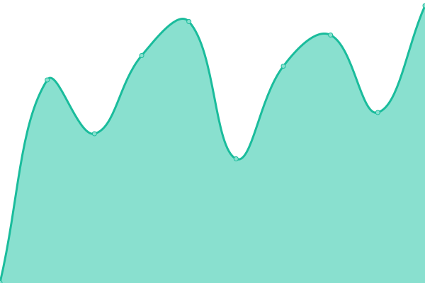

# [📈 Live Status](https://joevaughan.github.io/upptime): <!--live status--> **🟧 Partial outage**

This repository contains the open-source uptime monitor and status page for [joevaughan](https://joevaughan.github.io/upptime), powered by [Upptime](https://github.com/upptime/upptime).

With [Upptime](https://upptime.js.org), you can get your own unlimited and free uptime monitor and status page, powered entirely by a GitHub repository. We use [Issues](https://github.com/joevaughan/upptime/issues) as incident reports, [Actions](https://github.com/joevaughan/upptime/actions) as uptime monitors, and [Pages](https://joevaughan.github.io/upptime) for the status page.

<!--start: status pages-->
<!-- This summary is generated by Upptime (https://github.com/upptime/upptime) -->
<!-- Do not edit this manually, your changes will be overwritten -->
<!-- prettier-ignore -->
| URL | Status | History | Response Time | Uptime |
| --- | ------ | ------- | ------------- | ------ |
|  [joevaughan.com (my portfolio)](https://joevaughan.com) | 🟩 Up | [joevaughan-com-my-portfolio.yml](https://github.com/joevaughan/upptime/commits/HEAD/history/joevaughan-com-my-portfolio.yml) | 

 680ms
     
 | 

<a href="https://joevaughan.github.io/upptime/history/joevaughan-com-my-portfolio">100.00%</a>
    

|  [snipz.io (snippet manager)](https://snipz.io) | 🟩 Up | [snipz-io-snippet-manager.yml](https://github.com/joevaughan/upptime/commits/HEAD/history/snipz-io-snippet-manager.yml) | 

 375ms
     
 | 

<a href="https://joevaughan.github.io/upptime/history/snipz-io-snippet-manager">100.00%</a>
    

|  [paretoprincipals.co.uk (my company)](https://paretoprincipals.co.uk) | 🟩 Up | [paretoprincipals-co-uk-my-company.yml](https://github.com/joevaughan/upptime/commits/HEAD/history/paretoprincipals-co-uk-my-company.yml) | 

 575ms
     
 | 

<a href="https://joevaughan.github.io/upptime/history/paretoprincipals-co-uk-my-company">100.00%</a>
    

|  [thephotographywaffle.com (my podcast)](https://thephotographywaffle.com) | 🟥 Down | [thephotographywaffle-com-my-podcast.yml](https://github.com/joevaughan/upptime/commits/HEAD/history/thephotographywaffle-com-my-podcast.yml) | 

 522ms
     
 | 

<a href="https://joevaughan.github.io/upptime/history/thephotographywaffle-com-my-podcast">100.00%</a>
    

<!--end: status pages-->

[**Visit our status website →**](https://joevaughan.github.io/upptime)

## 📄 License

- Powered by: [Upptime](https://github.com/upptime/upptime)
- Code: [MIT](./LICENSE) © [joevaughan](https://joevaughan.github.io/upptime)
- Data in the `./history` directory: [Open Database License](https://opendatacommons.org/licenses/odbl/1-0/)
